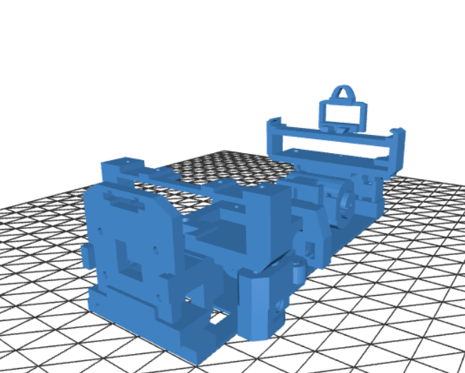
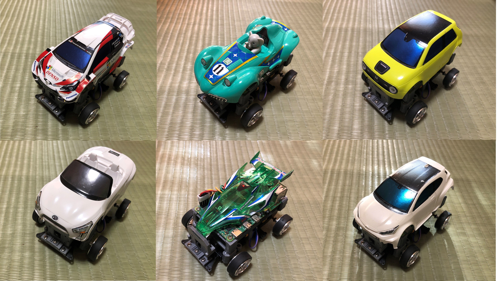

# TatamiRacer
TatamiRacer is tiny autonomous driving car based on [TAMIYA MINI 4WD kit](https://www.tamiya.com/english/mini4wd/m4item/m4item.htm)  
You can drive arround only one [Tatami](https://en.wikipedia.org/wiki/Tatami) mat space.(Approximately 1.8m x 0.9m)  
[Donkey car](http://docs.donkeycar.com/) software is available for deep-learning and self-driving control.  

  

# Bills of materials(BOM)
| Name | Remarks | Amazon JP | Amazon US|
|:---:|:---|:---|:---|
| Raspberry Pi 3 Model B+ | | [Link](https://www.amazon.co.jp/dp/B087WKPWNW/) | [Link](https://www.amazon.com/dp/B07P4LSDYV) |
| Raspberry Pi Camera Module V2  | | [Link](https://www.amazon.co.jp/dp/B07W6NK7TW/) | [Link](https://www.amazon.com/dp/B07W6THFPH/) |
| Micro SD Card | For Raspberry Pi/32GB| [Link](https://www.amazon.co.jp/dp/B06XWMQ81P/) | [Link](https://www.amazon.com/dp/B06XWMQ81P) |
| Mobile Battery | Size:6.2x9.15x1.15cm Voltage:5V Current:Up to 2A |[Link](https://www.amazon.co.jp/dp/B07SN2R3S2/) | [Link](https://www.amazon.com/dp/B082X53VDL/) |
| Motor Driver Module| For DC Motor/H-Bridge| [Link](https://www.amazon.co.jp/dp/B078X88R27/) | [Link](https://www.amazon.com/dp/B07Y1QJZK3/) |
| 130 DC Motor | Low Speed (<8000 RPM) and Low Current(<500m A)| [Link](https://www.amazon.co.jp/dp/B005AFBLIA/) | [Link](https://www.amazon.com/dp/https://www.amazon.com/dp/B0743835CY) |
| Micro Servo | SG90| [Link](https://www.amazon.co.jp/dp/B016FKJJ8M/) | [Link](https://www.amazon.com/dp/B083JYP59Y/) |
| TAMIYA Mini 4WD Kit | VZ Chassis and Your Favorite Body| [Link](https://www.amazon.co.jp/dp/B08C5FM9HM/) | [Link](https://www.amazon.com/dp/B083JYP59Y/) |
| TAMIYA Mini 4WD Roller parts | Include M2 screws| [Link](https://www.amazon.co.jp/dp/B004LVOV8G/) | [Link](https://www.amazon.com/dp/B075FM86KG/) |
| TAMIYA MINI4WD 72mm Shaft | Extended Rear Shaft| [Link](https://www.amazon.co.jp/dp/B003GALRS0/) | [Link](https://www.amazon.com/dp/B002CAO2IC/) |
| Micro USB Cable | Short cable 10cm| [Link](https://www.amazon.co.jp/dp/B07PTZ6VGV/) | [Link](https://www.amazon.com/dp/B01FA4JXN0/) |
| Jumper Cable | Female to Female 10cm| [Link](https://www.amazon.co.jp/dp/B07MR1SVVR/) | [Link](https://www.amazon.com/dp/B0742RS6YL/) |

# 3D Printed Parts

  
  
  
  
  
  
# Circuit Diagram

# Body Selection
It can be attaced various type of Mini-4WD body.[e.g. Amazon US](https://www.amazon.com/s?k=tamiya+1%2F32+mini4wd&ref=nb_sb_noss)  

# Tatami Circuit Cource

# Lap Time Measurement
  
Lap time measurement by smart phone camera  

e.g. [Mini4 Lap Timer](https://apps.apple.com/jp/app/mini4-lap-timer/id1280883925)  

# How to Build
See [How to Build TatamiRacer](doc/HowToBuildTatamiRacer.md)  

