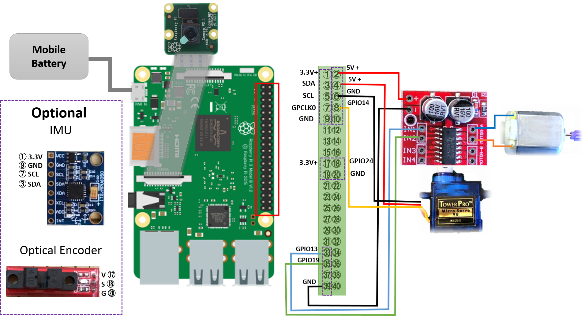

[日本語 Japanese](https://github.com/covao/TatamiRacer/blob/master/README_JP.md) / [English](https://github.com/covao/TatamiRacer/blob/master/README.md)  

    
TatamiRacer is a tiny autonomous driving car based on the ["TAMIYA MINI 4WD" kit](https://www.tamiya.com/english/mini4wd/m4item/m4item.htm). It can operate within the space of a single ["Tatami"](https://en.wikipedia.org/wiki/Tatami) mat, approximately 1.8m x 0.9m. The car uses ["Donkey Car"](http://docs.donkeycar.com/) software for deep learning and self-driving control. Interestingly, the Japanese word "Tatami" also brings to mind convolution operations in neural networks.

### YouTube  
- TatamiRacer 

  

- TatamiRacer at Maker Faire Tokyo 2022  

  

# Release History

### [ver 1.0](https://github.com/covao/TatamiRacer/tree/1.0) 2023-05-28
### [ver 2.0](https://github.com/covao/TatamiRacer)
- Renewed 3D Parts
- Reduced mobile battery size and weight
- Supports installation of Raspberry Pi Zero

# Bills of materials(BOM)
| Parts Name | Remarks |Minimum Configuration|Recommend Configuration|Amazon-JP|Amazon-US|
|:---|:---|:---:|:---:|:---:|:---:|
| Raspberry Pi Zero2 W ||+|| [Link](https://www.amazon.co.jp/dp/B09LH5SBPS/) | [Link](https://www.amazon.com/dp/B09LH5SBPS) |
| Raspberry Pi 4 |Select 2,4 or 8GB RAM||+| [Link](https://www.amazon.co.jp/dp/B09GRVDPCX/) | [Link](https://www.amazon.com/dp/B07TC2BK1X) |
| Raspberry Pi Camera Module  | v1.3:OV5647(Omnivision) or v2.1:IMX219Pq3(SONY)|+|+| [v1.3](https://www.amazon.co.jp/dp/B073RCXGQS/) [v2.1](https://www.amazon.co.jp/dp/B01F1SWTZE)| [v1.3](https://www.amazon.com/dp/B07QNSJ32M/) [v2.1](https://www.amazon.com/dp/B01ER2SKFS)|
| Micro SD Card | 16GB or more|+|+| [e.g.](https://www.amazon.co.jp/dp/B0CH2WM7QY/) | [e.g.](https://www.amazon.com/dp//B08J4HJ98L) |
| Mobile Battery | Size:53x85x9.0mm Voltage:5V Current:Up to 2.1A |+|+|[Meisei C0303](https://www.amazon.co.jp/dp/B07Q5M3CLQ/) | [Atom Tech Super Slim Power Bank](https://www.amazon.com/dp/B07JZCZSH9/) |
| Motor Driver Module| For DC Motor/H-Bridge|+|+| [L298N ](https://www.amazon.co.jp/dp/B083DT2DMV/) |[L298N ](https://www.amazon.com/dp/B07Y1QJZK3/) |
| Pin Headder | Male 90deg / For Motor Dirver|+|+| [Link](https://www.amazon.co.jp/dp/B00V4V703O/) |[Link](https://www.amazon.com/dp/B0979568B3/) |
| 130 DC Motor | Low Speed (<8000 RPM) and Low Current(<500mA)|+|+|[TAMIYA](https://www.amazon.co.jp/dp/B005AFBLIA/),[uxcell](https://www.amazon.co.jp/dp/B07CWLWRYJ/) | [Link](https://www.amazon.com/dp/B01ERLPVJW) |
| Micro Servo |TowerPro SG90(0.1sec/60deg)|+|+| [Link](https://www.amazon.co.jp/dp/B016FKJJ8M/) | [Link](https://www.amazon.com/dp/B07MLR1498/) |
| TAMIYA Mini 4WD Kit |VZ Chassis and Your Favorite Body. Select Gear Rate 3.5:1 or 5:1 (Recommend 5:1 Gear )|+|+| [Elephant with 5:1 gear](https://www.amazon.co.jp/dp/B08VX3W3Q6/), [TOYOTA Yaris with 3.5:1 Gear](https://www.amazon.co.jp/dp/B08C5FM9HM/), [Honda e with 3.5.1 Gear](https://www.amazon.co.jp/dp/B08HK7HWCM/), [Dual Ridge Jr](https://www.amazon.co.jp/dp/B088FK3NC2/) |[Neo-VQS](https://www.amazon.com/dp/B005GJCC9C/) |
|TAMIYA Gear Set |If you change gear rate (e.g. 5:1)|||[15516](https://www.amazon.co.jp/dp/B0043RN7W4/)|[15516](https://www.amazon.com/dp/B0043RN7W4/)|
| TAMIYA Mini 4WD Roller parts | Need Spacer and M2x10 screws|+|+| [15381](https://www.amazon.co.jp/dp/B001E40PXI/), [95391](https://www.amazon.co.jp/dp/B07F8RLJBQ/),[15435](https://www.amazon.co.jp/dp/B005GJCC9C/)|[15435](https://www.amazon.com/dp/B005GJCC9C/) | 
| M2x15 or M2x16 mm bolt | For front wheel shaft |+|+| [15508](https://www.amazon.co.jp/dp/B01MXVKDOM/),  [15233](https://www.amazon.co.jp/dp/B001VZE9MS/)| [Link](https://www.amazon.com/dp/B07YS5ZSZH/) |
| TAMIYA MINI4WD 72mm Shaft | For Extended Rear Shaft|+|+| [Link](https://www.amazon.co.jp/dp/B003GALRS0/) | [Link](https://www.amazon.com/dp/B002CAO2IC/) |
| Jumper Cable | Female connector to Female connector 10cm|+|+| [Link](https://www.amazon.co.jp/dp/B07MR1SVVR/) | [Link](https://www.amazon.com/dp/B0742RS6YL) |
| Type-C USB Cable | Short cable 15-20cm L Headder |+|+| [e.g.](https://www.amazon.co.jp/dp/B0B4JQ41SW/) [Type-C](https://www.amazon.co.jp/dp/B07TFHWVPY)| [e.g.](https://www.amazon.com/dp/B01FA4JXN0/) [e.g.](https://www.amazon.com/dp/B07TFHWVPY) |
| Gamepad | USB or Bluetooth | |+| [F710](https://www.amazon.co.jp/dp/B00CDG7994/), [PS4 compatible Gamepad](https://www.amazon.co.jp/dp/B0BZCPJYHS/)  | [F710](https://www.amazon.com/dp/B0041RR0TW/), [PS4 compatible Gamepad](https://www.amazon.com/dp/B0D6GDZZP8/) |
||  || |  |  |
| Approximate cost (without Raspberry Pi and micro SD card) |  |6,000 yen |13,000 yen |  |  |

# 3D Printed Parts

## [Assembly (STL Viewer)](3d/tatamiracer_assembly.stl)  
  
  
## [Kit for 3D print(STL Viewer)](3d/tatamiracer_kit.stl)  
  
  
# Circuit Diagram

# Body
Various type of Mini-4WD body can be attaced .e.g. [Amazon JP](https://www.amazon.co.jp/s?k=%E3%83%9F%E3%83%8B%E5%9B%9B%E9%A7%86+and+%E3%83%97%E3%83%A9%E3%83%A2%E3%83%87%E3%83%AB+and+%E3%82%B7%E3%83%A3%E3%83%BC%E3%82%B7&__mk_ja_JP=%E3%82%AB%E3%82%BF%E3%82%AB%E3%83%8A&ref=nb_sb_noss), [Amazon US](https://www.amazon.com/s?k=tamiya+1%2F32+mini4wd&ref=nb_sb_noss)  

# Tatami-Circuit Cource
  

## Image data for printed fabric 
Fabric print service available  
- [Tatami-Circuit 150cmx100cm 200dpi](img/tatami_circuit_150cmx100cm_200dpi.jpg)  
- [Tatami-Circuit 110cmx100cm 200dpi](img/tatami_circuit_110cmx100cm_200dpi.jpg)  

# [TatamiRacer Assembly Instructions](doc/Assembly_Instructions.md)
See [TatamiRacer Assembly Instructions](doc/Assembly_Instructions.md)  

# [How to Setup Software](doc/HowToSetupSoftware.md) 
See [How To Setup Software](doc/HowToSetupSoftware.md)  

#  [How to Calibrate TatamiRacer](doc/HowToCalibrateTatamiRacer.md)  
See [How to Calibrate TatamiRacer](doc/HowToCalibrateTatamiRacer.md)  

# [How to Get Driving](doc/HowToGetDriving.md)
See [How to Get Driving](doc/HowToGetDriving.md)  
  
[Donkey Copilot Broweser Demo](https://covao.github.io/DonkeyCopilot/copilot.html?demo)

