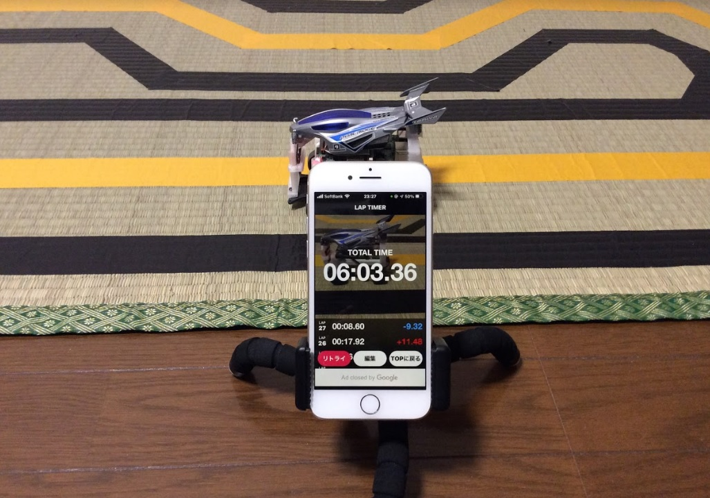

[日本語 Japanese](https://github.com/covao/TatamiRacer/blob/master/README_JP.md) / [English](https://github.com/covao/TatamiRacer/blob/master/README.md)  

    
TatamiRacer is tiny autonomous driving car.  
It is based on ["TAMIYA MINI 4WD" kit](https://www.tamiya.com/japan/mini4wd/index.html).  
You can drive on one [Tatami](https://en.wikipedia.org/wiki/Tatami) mat space(Approximately 1.8m x 0.9m).  
["Donkey Car"](http://docs.donkeycar.com/) software is available for deep-learning and self-driving control.  

YouTube  

# Bills of materials(BOM)
| Parts Name | Remarks |Minimum Configuration|Recommend Configuration|Amazon-JP|Amazon-US|
|:---|:---|:---:|:---:|:---:|:---:|
| Raspberry Pi 3 Model B+ | |+|| [Link](https://www.amazon.co.jp/dp/B01NAHBSUD) | [Link](https://www.amazon.com/dp/B07P4LSDYV) |
| Raspberry Pi 4 |Select 2,4 or 8GB RAM||+| [Link](https://www.amazon.co.jp/dp/B09GRVDPCX/) | [Link](https://www.amazon.com/dp/B07TC2BK1X) |
| Raspberry Pi Camera Module V1 | OV5647(Omnivision) |+|| [Link](https://www.amazon.co.jp/dp/B073RCXGQS/) | [Link](https://www.amazon.com/dp/B07QNSJ32M/) |
| Raspberry Pi Camera Module V2 | IMX219PQ(SONY) ||+| [Link](https://www.amazon.co.jp/dp/B01F1SWTZE/) | [Link](https://www.amazon.com/dp/B083BHJZ16/) |
| Micro SD Card | 16GB or more|+|+| [Link](https://www.amazon.co.jp/dp/B088TYHF8V/) | [Link](https://www.amazon.com/dp//B00M55BS8G) |
| Mobile Battery | Size:6.2x9.15x1.15cm Voltage:5V Current:Up to 2A |+|+|[Link](https://www.amazon.co.jp/dp/B07SN2R3S2/) | [Link](https://www.amazon.com/dp/B082X53VDL/) |
| Motor Driver Module| For DC Motor/H-Bridge|+|+| [Link](https://www.amazon.co.jp/dp/B078X88R27/) |[Link](https://www.amazon.com/dp/B07Y1QJZK3/) |
| 130 DC Motor | Low Speed (<8000 RPM) and Low Current(<500m A)|+|+|[TAMIYA](https://www.amazon.co.jp/dp/B005AFBLIA/),[uxcell](https://www.amazon.co.jp/dp/B07CWLWRYJ/) | [Link](https://www.amazon.com/dp/B01ERLPVJW) |
| Micro Servo |TowerPro SG90 |+|+| [Link](https://www.amazon.co.jp/dp/B016FKJJ8M/) | [Link](https://www.amazon.com/dp/B07MLR1498/) |
| TAMIYA Mini 4WD Kit |VZ Chassis and Your Favorite Body. Select Gear Rate 3.5:1 or 5:1 (Recommend 5:1 Gear )|+|+| [TOYOTA Yaris](https://www.amazon.co.jp/dp/B08C5FM9HM/), [Honda e](https://www.amazon.co.jp/dp/B08HK7HWCM/), [Dual Ridge Jr](https://www.amazon.co.jp/dp/B088FK3NC2/), [Elephant](https://www.amazon.co.jp/dp/B08VX3W3Q6/), [Penguin](https://www.amazon.co.jp/dp/B0043RYKPW/)| [Neo-VQS](https://www.amazon.com/dp/B083JYP59Y/) |
|TAMIYA Gear Set |If you need 5:1|||[Link](https://www.amazon.co.jp/dp/B009WJG2ES/)|[Link](https://www.amazon.com/dp/B0043RN7W4/)|
| TAMIYA Mini 4WD Roller parts | Need Spacer and M2x10 screws|+|+| [15381](https://www.amazon.co.jp/dp/B001E40PXI/) | [TOYOTA Yaris](https://www.amazon.co.jp/dp/B08C5FM9HM/),[Neo-VQS](https://www.amazon.com/dp/B005GJCC9C/) |
| M2x15 or M2x16 mm bolt | For front wheel shaft |+|+| [15508](https://www.amazon.co.jp/dp/B01MXVKDOM/),  [15233](https://www.amazon.co.jp/dp/B001VZE9MS/)| [Link](https://www.amazon.com/dp/B07YS5ZSZH/) |
| TAMIYA MINI4WD 72mm Shaft | For Extended Rear Shaft|+|+| [Link](https://www.amazon.co.jp/dp/B003GALRS0/) | [Link](https://www.amazon.com/dp/B002CAO2IC/) |
| Jumper Cable | Female connector to Female connector 10cm|+|+| [Link](https://www.amazon.co.jp/dp/B07MR1SVVR/) | [Link](https://www.amazon.com/dp/B0742RS6YL) |
| Micro USB Cable | Short cable about 15cm |+|+| [Link](https://www.amazon.co.jp/dp/B07PTZ6VGV/) | [Link](https://www.amazon.com/dp/B01FA4JXN0/) |
| Micro USB to Type-C Adaptor | For Raspberry pi 4 | |+| [Link](https://www.amazon.co.jp/dp/B06XFL6159/) | [Link](https://www.amazon.com/dp/B07G54XXZZ/) |
| Game Pad | F710 | |+| [Link](https://www.amazon.co.jp/dp/B00475S13W/) | [Link](https://www.amazon.com/dp/B0041RR0TW/) |
||  || |  |  |
| Approximate cost (without Raspberry Pi and micro SD card) |  |6,000 yen |13,000 yen |  |  |

# 3D Printed Parts

  
  
  
  
  
  
# Circuit Diagram

# Body
Various type of Mini-4WD body can be attaced .e.g. [Amazon JP](https://www.amazon.co.jp/s?k=%E3%83%9F%E3%83%8B%E5%9B%9B%E9%A7%86+and+%E3%83%97%E3%83%A9%E3%83%A2%E3%83%87%E3%83%AB+and+%E3%82%B7%E3%83%A3%E3%83%BC%E3%82%B7&__mk_ja_JP=%E3%82%AB%E3%82%BF%E3%82%AB%E3%83%8A&ref=nb_sb_noss), [Amazon US](https://www.amazon.com/s?k=tamiya+1%2F32+mini4wd&ref=nb_sb_noss)  

# Tatami-Circuit Cource

# Lap Time Measurement
  
Lap time measurement by smart phone camera  

e.g. [Mini4 Lap Timer](https://apps.apple.com/jp/app/mini4-lap-timer/id1280883925)  

# TatamiRacer Assembly Instructions
See [TatamiRacer Assembly Instructions](doc/Assembly_Instructions.md)  

# [How to Setup Software](doc/HowToSetupSoftware.md) 
See [How To Setup Software](doc/HowToSetupSoftware.md)  

#  How to Calibration TatamiRacer
See [How to Calibration TatamiRacer](doc/HowToCalibrateTatamiRacer.md)

# How to Get Driving
See [How to Get Driving](doc/HowToGetDriving.md)  

