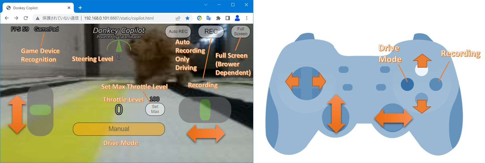

[日本語 Japanese](https://github.com/covao/TatamiRacer/blob/master/README_JP.md) / [English](https://github.com/covao/TatamiRacer/blob/master/README.md)  

### ver 2.0      
TatamiRacerは、["TAMIYA MINI 4WD"キット](https://www.tamiya.com/english/mini4wd/m4item/m4item.htm)をベースにした小型の自律走行車です。約1.8m x 0.9mの1枚の["畳"](https://en.wikipedia.org/wiki/Tatami)のスペース内で動作することができます。車両は深層学習と自律走行制御のために["Donkey Car"](http://docs.donkeycar.com/)ソフトウェアを使用しています。興味深いことに、日本語の「畳」という言葉は、ニューラルネットワークの畳み込み演算をも思い起こさせます。

### YouTube  
- TatamiRacer 

  

- Maker Faire Tokyo 2022でのTatamiRacer  

  

# リリース履歴

### [ver 1.0](https://github.com/covao/TatamiRacer/tree/1.0) 2023-05-28
### [ver 2.0](https://github.com/covao/TatamiRacer)
- 3Dパーツの更新
- モバイルバッテリーのサイズと重量を削減
- Raspberry Pi Zero 2のインストールをサポート

# 部品表(BOM)
| パーツ名 | 備考 | 最小構成 | 推奨構成 | Amazon-JP | Amazon-US |
|:---|:---|:---:|:---:|:---:|:---:|
| Raspberry Pi Zero2 W ||+|| [リンク](https://www.amazon.co.jp/dp/B09LH5SBPS/) | [リンク](https://www.amazon.com/dp/B09LH5SBPS) |
| Raspberry Pi 4 |2、4、または8GB RAMを選択||+| [リンク](https://www.amazon.co.jp/dp/B09GRVDPCX/) | [リンク](https://www.amazon.com/dp/B07TC2BK1X) |
| Raspberry Pi カメラモジュール  | v1.3:OV5647(Omnivision) または v2.1:IMX219Pq3(SONY)|+|+| [v1.3](https://www.amazon.co.jp/dp/B073RCXGQS/), [v2.1](https://www.amazon.co.jp/dp/B01F1SWTZE)| [v1.3](https://www.amazon.com/dp/B07QNSJ32M/),  [v2.1](https://www.amazon.com/dp/B01ER2SKFS)|
| Micro SD カード | 16GB以上|+|+| [例: SanDisk](https://www.amazon.co.jp/dp/B0CH2WM7QY/) | [例: SanDisk](https://www.amazon.com/dp//B08J4HJ98L) |
| モバイルバッテリー | サイズ:53x85x9.0mm 電圧:5V 電流:最大2.1A |+|+|[Meisei C0303](https://www.amazon.co.jp/dp/B07Q5M3CLQ/) | [Atom Tech Super Slim Power Bank](https://www.amazon.com/dp/B07JZCZSH9/) |
| モータードライバーモジュール| DCモーター/Hブリッジ用|+|+| [L298N ](https://www.amazon.co.jp/dp/B083DT2DMV/) |[L298N ](https://www.amazon.com/dp/B07Y1QJZK3/) |
| ピンヘッダー | オス 90度 / モータードライバー用|+|+| [リンク](https://www.amazon.co.jp/dp/B00V4V703O/) |[リンク](https://www.amazon.com/dp/B0979568B3/) |
| 130 DCモーター | 低速 (<8000 RPM) かつ低電流(<500mA)|+|+|[TAMIYA](https://www.amazon.co.jp/dp/B005AFBLIA/),[uxcell](https://www.amazon.co.jp/dp/B07CWLWRYJ/) | [uxcell](https://www.amazon.com/dp/B01ERLPVJW) |
| マイクロサーボ |TowerPro SG90(0.1秒/60度)|+|+| [リンク](https://www.amazon.co.jp/dp/B016FKJJ8M/) | [リンク](https://www.amazon.com/dp/B07MLR1498/) |
| TAMIYA ミニ四駆キット |VZシャーシとお好みのボディ。ギア比3.5:1または5:1を選択（推奨ギア比5:1）|+|+| [ぞうさん with 5:1 ギア](https://www.amazon.co.jp/dp/B08VX3W3Q6/), [TOYOTA Yaris with 3.5:1 ギア](https://www.amazon.co.jp/dp/B08C5FM9HM/), [Honda e with 3.5.1 ギア](https://www.amazon.co.jp/dp/B08HK7HWCM/), [Dual Ridge Jr](https://www.amazon.co.jp/dp/B088FK3NC2/) |[Neo-VQS](https://www.amazon.com/dp/B005GJCC9C/) |
|TAMIYA ギアセット |ギア比を変更する場合（例: 5:1）|||[15516](https://www.amazon.co.jp/dp/B0043RN7W4/)|[15516](https://www.amazon.com/dp/B0043RN7W4/)|
| TAMIYA ミニ四駆ローラー部品 | スペーサーとM2x10ネジが必要|+|+| [15381](https://www.amazon.co.jp/dp/B001E40PXI/), [95391](https://www.amazon.co.jp/dp/B07F8RLJBQ/),[15435](https://www.amazon.co.jp/dp/B005GJCC9C/)|[15435](https://www.amazon.com/dp/B005GJCC9C/) | 
| M2x15またはM2x16 mmボルト | フロントホイールシャフト用 |+|+| [15508](https://www.amazon.co.jp/dp/B01MXVKDOM/),  [15233](https://www.amazon.co.jp/dp/B001VZE9MS/)| [リンク](https://www.amazon.com/dp/B07YS5ZSZH/) |
| TAMIYA ミニ四駆72mmシャフト | 延長リアシャフト用|+|+| [リンク](https://www.amazon.co.jp/dp/B003GALRS0/) | [リンク](https://www.amazon.com/dp/B002CAO2IC/) |
| ジャンパーケーブル | メスコネクタからメスコネクタ 10cm|+|+| [リンク](https://www.amazon.co.jp/dp/B07MR1SVVR/) | [リンク](https://www.amazon.com/dp/B0742RS6YL) |
| Type-C USBケーブル(L字ヘッダー) | ショートケーブル 15-20cm ||+| [例: aceyoon](https://www.amazon.co.jp/dp/B0B4JQ41SW/)| [例: aceyoon](https://www.amazon.com/dp/B096VYVR17/) |
| ゲームパッド | USBまたはBluetooth | |+| [F710](https://www.amazon.co.jp/dp/B00CDG7994/), [PS4互換ゲームパッド](https://www.amazon.co.jp/dp/B0C4NW3G8J/)  | [F710](https://www.amazon.com/dp/B0041RR0TW/), [PS4互換ゲームパッド](https://www.amazon.com/dp/B0C4NW3G8J/) |
||  || |  |  |
| 概算コスト（Raspberry Piとmicro SDカードを除く） |  |6,000円 |10,000円 |  |  |

# 3Dプリントパーツ

## 組み立て
[3Dビューアー](3d/tatamiracer_assembly.stl)を参照  

  
  
## 3Dプリント用キット
[3Dビューアー](3d/tatamiracer_kit.stl)を参照  
  
  
# 回路図

# ボディ
さまざまな種類のミニ四駆ボディを取り付け可能です。例：[Amazon JP](https://www.amazon.co.jp/s?k=%E3%83%9F%E3%83%8B%E5%9B%9B%E9%A7%86+and+%E3%83%97%E3%83%A9%E3%83%A2%E3%83%87%E3%83%AB+and+%E3%82%B7%E3%83%A3%E3%83%BC%E3%82%B7&__mk_ja_JP=%E3%82%AB%E3%82%BF%E3%82%AB%E3%83%8A&ref=nb_sb_noss), [Amazon US](https://www.amazon.com/s?k=tamiya+1%2F32+mini4wd&ref=nb_sb_noss)  

# 畳コース
  

## ファブリックプリント用イメージデータ 
ファブリックプリントサービス利用可能  
- [畳サーキット 150cmx100cm 200dpi](img/tatami_circuit_150cmx100cm_200dpi.jpg)  
- [畳サーキット 110cmx100cm 200dpi](img/tatami_circuit_110cmx100cm_200dpi.jpg)  

# [TatamiRacer 組み立て手順](doc/Assembly_Instructions.md)
[TatamiRacer 組み立て手順](doc/Assembly_Instructions.md)を参照  

# [ソフトウェアのセットアップ方法](doc/HowToSetupSoftware.md) 
[ソフトウェアのセットアップ方法](doc/HowToSetupSoftware.md)を参照  

#  [TatamiRacerのキャリブレーション方法](doc/HowToCalibrateTatamiRacer.md)  
[TatamiRacerのキャリブレーション方法](doc/HowToCalibrateTatamiRacer.md)を参照  

# [操作方法](doc/HowToGetDriving.md)
[操作方法](doc/HowToGetDriving.md)を参照  
  

UI操作画面を見るにはクリック  
[Donkey Copilot ブラウザデモ](https://covao.github.io/DonkeyCopilot/copilot.html?demo)
