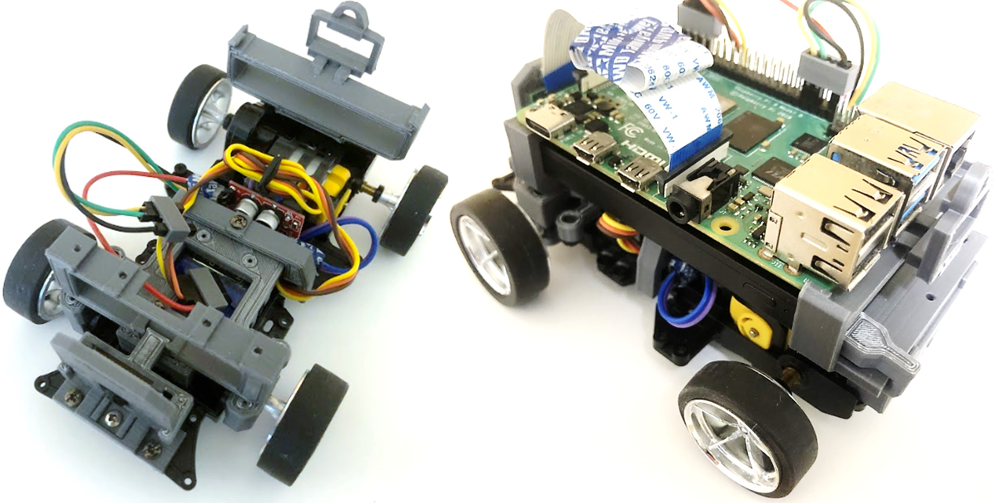
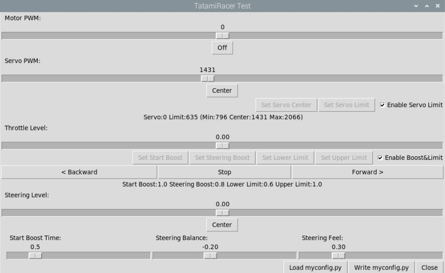
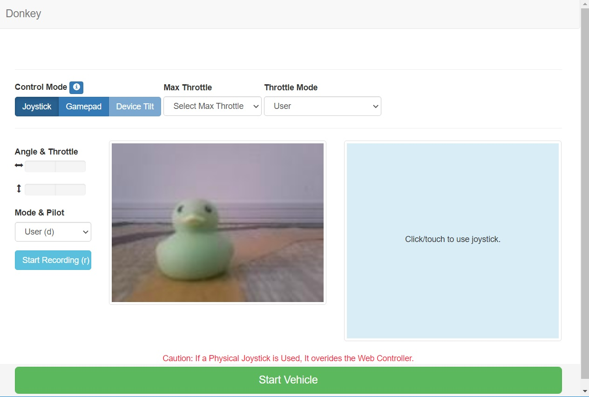

[日本語 Japanese](https://github.com/covao/TatamiRacer/blob/master/README_JP.md) / [English](https://github.com/covao/TatamiRacer/blob/master/README.md)  

    
TatamiRacer は、小さな自動運転車です。
[TAMIYA ミニ四駆キット](https://www.tamiya.com/japan/mini4wd/index.html)をベースにしています。  
[畳](https://en.wikipedia.org/wiki/Tatami) マット1枚分(約1.8m×0.9m)で運転できます。  
["Donkey Car"](http://docs.donkeycar.com/)ソフトウエア は、深層学習と自動運転制御に利用できます。  

  
Youtube Link 
  

# 部品表(BOM)
|部品名 |備考 |最小構成|推奨構成|Amazon-JP|Amazon-US|
|:---|:---|:---:|:---:|:---:|:---:|
| Raspberry Pi 3 モデル B+ | |+|| [リンク](https://www.amazon.co.jp/dp/B087R57WJX/) | [リンク](https://www.amazon.com/dp/B07P4LSDYV) |
| Raspberry Pi 4 |2GB または 4GB RAM を選択||+| [リンク](https://www.amazon.co.jp/dp/B087TDC13Y/) | [リンク](https://www.amazon.com/dp/B07TC2BK1X) |
| Raspberry Pi カメラ モジュール V1 | OV5647(オムニビジョン) |+|| [リンク](https://www.amazon.co.jp/dp/B07G572B3R/) | [リンク](https://www.amazon.com/dp/B07QNSJ32M/) |
| Raspberry Pi カメラモジュール V2 | IMX219PQ(SONY) ||+| [リンク](https://www.amazon.co.jp/dp/B07W6NK7TW/) | [リンク](https://www.amazon.com/dp/B07W6THFPH/) |
|マイクロ SD カード | 16GB以上|+|+| [リンク](https://www.amazon.co.jp/dp/B088TYHF8V/) | [リンク](https://www.amazon.com/dp//B00M55BS8G) |
|モバイルバッテリー |サイズ:6.2x9.15x1.15cm 電圧:5V 電流:最大2A |+|+|[リンク](https://www.amazon.co.jp/dp/B07SN2R3S2/) | [リンク](https://www.amazon.com/dp/B082X53VDL/) |
|モータードライバーモジュール| DCモーター/H-Bridge用|+|+| [リンク](https://www.amazon.co.jp/dp/B078X88R27/) |[リンク](https://www.amazon.com/dp/B07Y1QJZK3/) |
| 130 DC モーター |低速 (<8000 RPM) および低電流 (<500m A)|+|+| [リンク](https://www.amazon.co.jp/dp/B005AFBLIA/) | [リンク](https://www.amazon.com/dp/B07Y1QJZK3) |
|マイクロサーボ | SG90 |+|+| [リンク](https://www.amazon.co.jp/dp/B016FKJJ8M/) | [リンク](https://www.amazon.com/dp/B07MLR1498/) |
|タミヤ ミニ四駆キット |VZシャーシとお好みのボディ。ギア レート 3.5:1 または 5:1 を選択します。(5：1ギアをお勧めします）|+|+| [TOYOTA Yaris](https://www.amazon.co.jp/dp/B08C5FM9HM/),[Honda e](https://www.amazon.co.jp/dp/B08HK7HWCM/) , [Dual Ridge Jr](https://www.amazon.co.jp/dp/B088FK3NC2/), [Elephant](https://www.amazon.co.jp/dp/B08VX3W3Q6/), [Penguin](https://www.amazon.co.jp/dp/B0043RYKPW/)| [Neo-VQS](https://www.amazon.com/dp/B083JYP59Y/) |
|タミヤ ミニ四駆 ローラーパーツ | スペーサーと M2x10 ネジ が必要です。 |+|+| [15381](https://www.amazon.co.jp/dp/B001E40PXI/) | [リンク](https://www.amazon.com/dp/B005GJCC9C/) |
| M2x15 または M2x16 mm ボルト |前輪シャフト用 |+|+| [15508](https://www.amazon.co.jp/dp/B01MXVKDOM/),  [15232](https://www.amazon.co.jp/dp/B001VZ89Q0/)| [リンク](https://www.amazon.com/dp/B07YS5ZSZH/) |
|タミヤ ミニ四駆 72mm シャフト |延長リヤシャフト用|+|+| [リンク](https://www.amazon.co.jp/dp/B003GALRS0/) | [リンク](https://www.amazon.com/dp/B002CAO2IC/) |
|ジャンパーケーブル |メスコネクタからメスコネクタ 10cm|+|+| [リンク](https://www.amazon.co.jp/dp/B07MR1SVVR/) | [リンク](https://www.amazon.com/dp/B0742RS6YL) |
|マイクロ USB ケーブル |ショートケーブル 約15cm |+|+| [リンク](https://www.amazon.co.jp/dp/B07PTZ6VGV/) | [リンク](https://www.amazon.com/dp/B01FA4JXN0/) |
|マイクロ USB から Type-C へのアダプター | Raspberry pi 4 の場合 | |+| [リンク](https://www.amazon.co.jp/dp/B06XFL6159/) | [リンク](https://www.amazon.com/dp/B07G54XXZZ/) |
|ゲームパッド | F710 | |+| [リンク](https://www.amazon.co.jp/dp/B00475S13W/) | [リンク](https://www.amazon.com/dp/B0041RR0TW/) |
||  || |  |  |
| 概算費用 (Raspberry PiとマイクロSDカードあり) |  |11,000 yen |20,000 yen |  |  |
| 概算費用 (Raspberry PiとマイクロSDカードなし) |  |6,000 yen |13,000 yen |  |  |

# 3Dプリントパーツ

  
  
  
  
  
  
# 回路図  

# ボディセレクション  
様々なタイプのミニ四駆ボディを装着可能。 
例 [Amazon JP](https://www.amazon.co.jp/s?k=%E3%83%9F%E3%83%8B%E5%9B%9B%E9%A7%86+and+%E3%83%97%E3%83%A9%E3%83%A2%E3%83%87%E3%83%AB+and+%E3%82%B7%E3%83%A3%E3%83%BC%E3%82%B7&__mk_ja_JP=%E3%82%AB%E3%82%BF%E3%82%AB%E3%83%8A&ref=nb_sb_noss), [Amazon US](https://www.amazon.com/s?k=tamiya+1%2F32+mini4wd&ref=nb_sb_noss)  

# Tatamiサーキットコース  

#  ラップタイム計測
  
スマートフォンカメラによるラップタイム計測  

例えば [Mini4 Lap Timer](https://apps.apple.com/jp/app/mini4-lap-timer/id1280883925)  

# [TatamiRacerのビルド方法](doc/HowToBuildTatamiRacer.md)  
[How to Build TatamiRacer](doc/HowToBuildTatamiRacer.md)を参照してください  

# [ソフトウェアのセットアップ方法](doc/HowToSetupSoftware.md)
[ソフトウェアのセットアップ方法](doc/HowToSetupSoftware.md)を参照してください

# TatamiRacer のキャリブレーション方法
[TatamiRacerのキャリブレーション方法](doc/HowToCalibrateTatamiRacer.md)を参照してください 

# TatamiRacerの運転方法
[TatamiRacerの運転方法](doc/HowToGetDriving.md)を参照してください 

# 機械学習によるTatamiRacerのトレーニング方法  
