[Japanese(Google Translate)](https://github-com.translate.goog/covao/TatamiRacer/blob/master/doc/Assembly_Instructions.md?_x_tr_sl=en&_x_tr_tl=ja&_x_tr_hl=ja&_x_tr_pto=wapp)  

# TatamiRacer Assembly Instructions 
### All Parts 
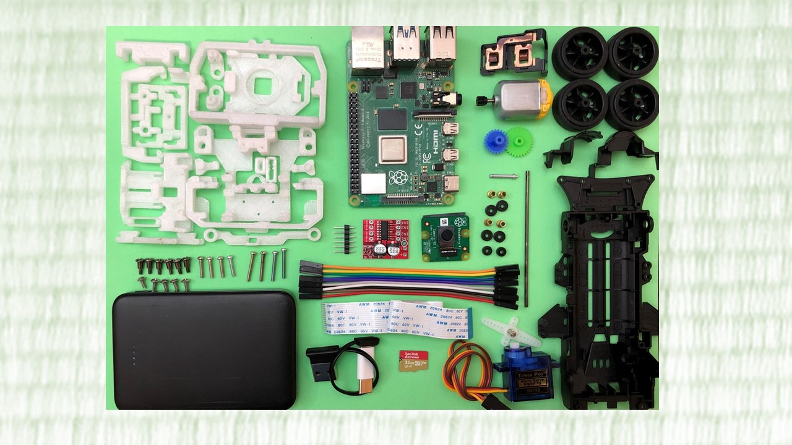

### Step 1. Assembling Front Wheel Parts
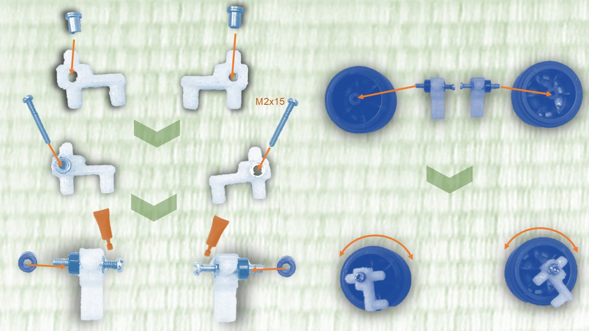

### Step 2. Assembling Front Steering Unit
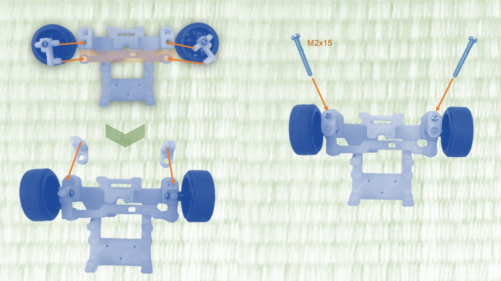 

### Step 3. Assembling Servo Motor
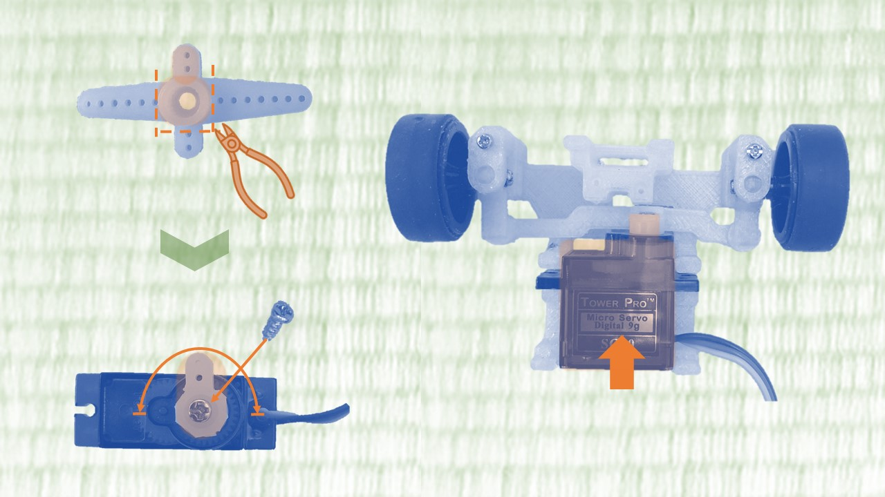 

### Step 4. Mounting Front Steering Unit 
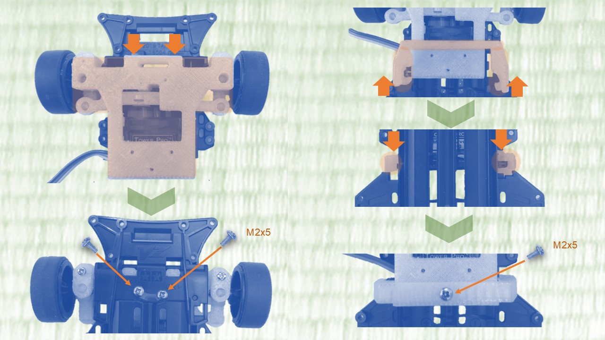 

### Step 5. Assembling Rear Wheel Drive Unit
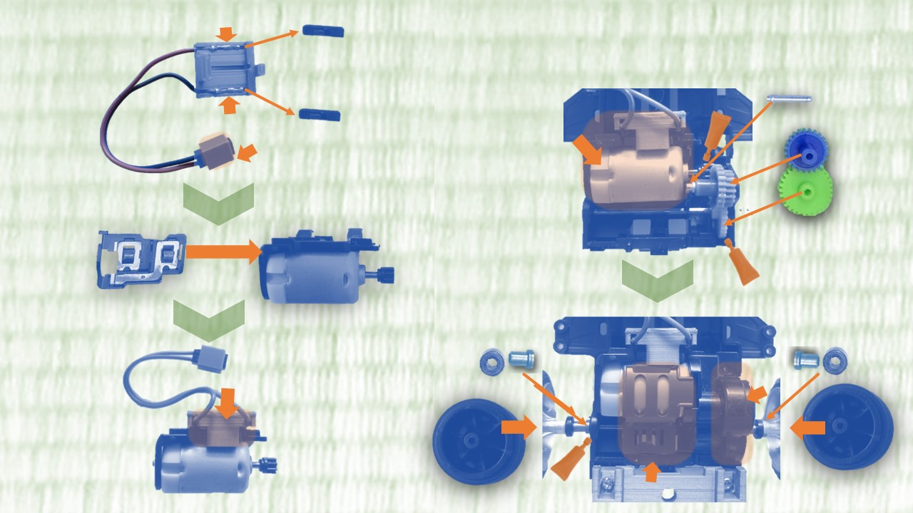 

### Step 6. Fixing Mount Parts
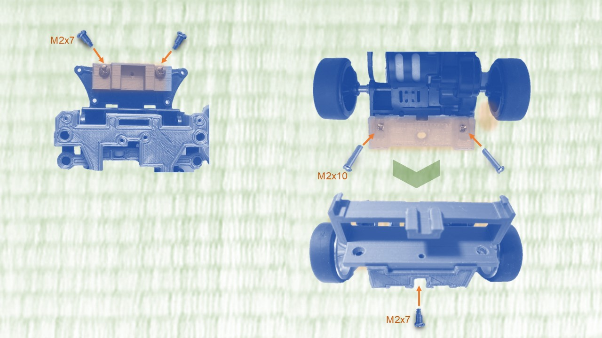 

### Step 7. Assembling Camera Module 
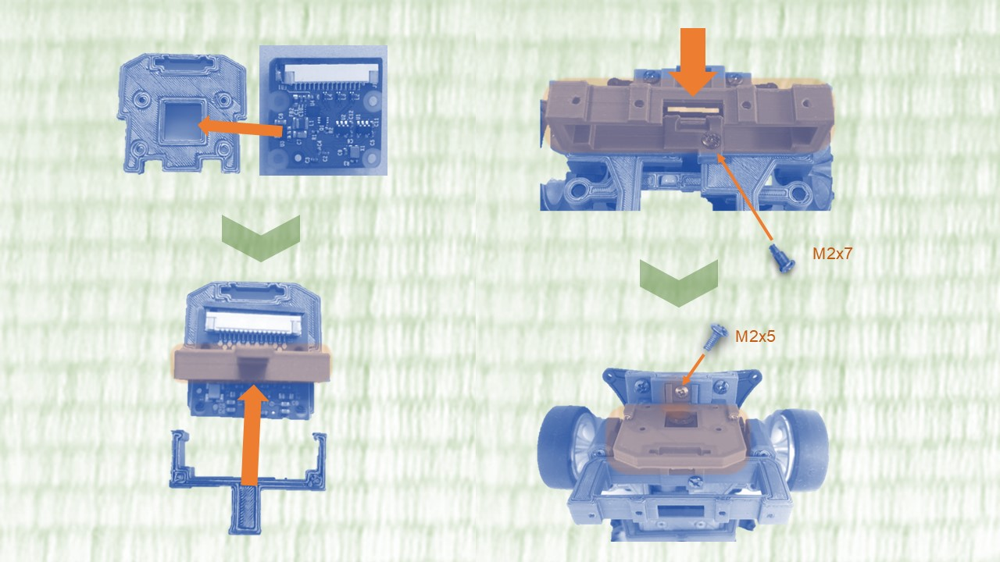 

### Step 8. Making Motor Driver and Harness 
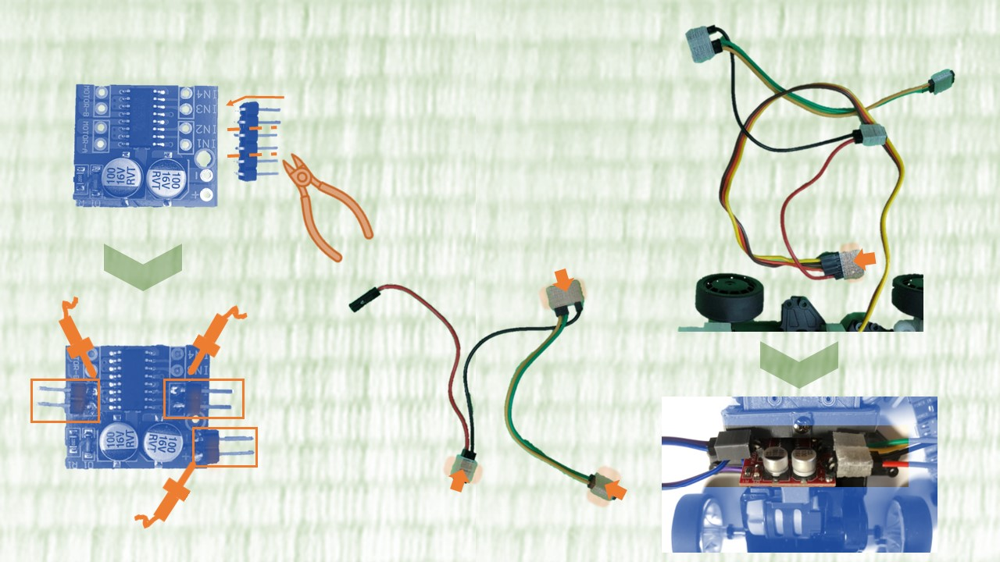 

### Step 9. Attaching Raspberry PI Board and Battery
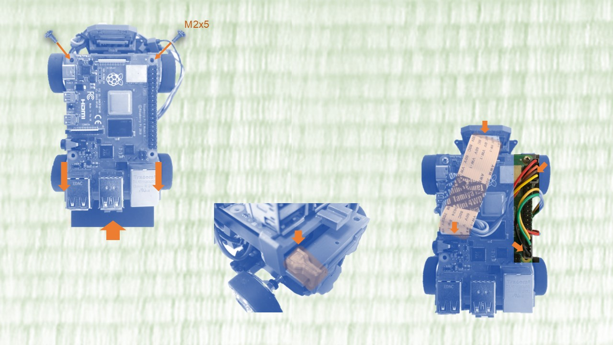 

### Step 10. Attaching the body
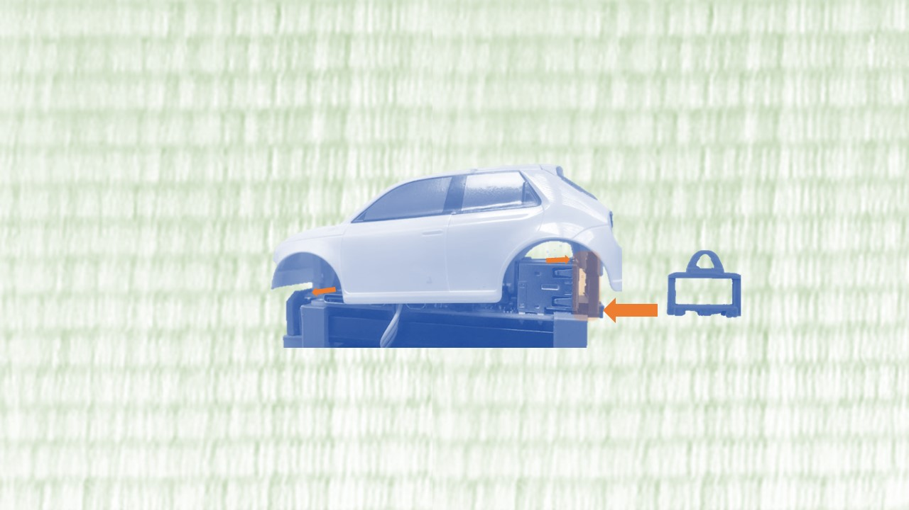 
