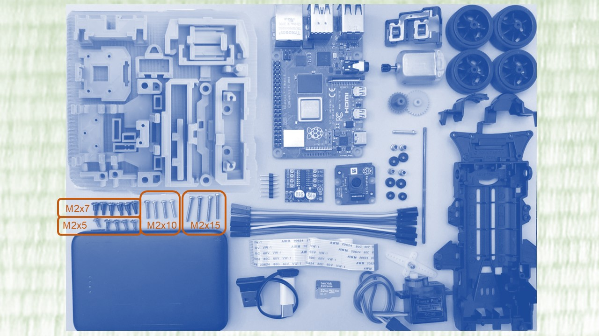
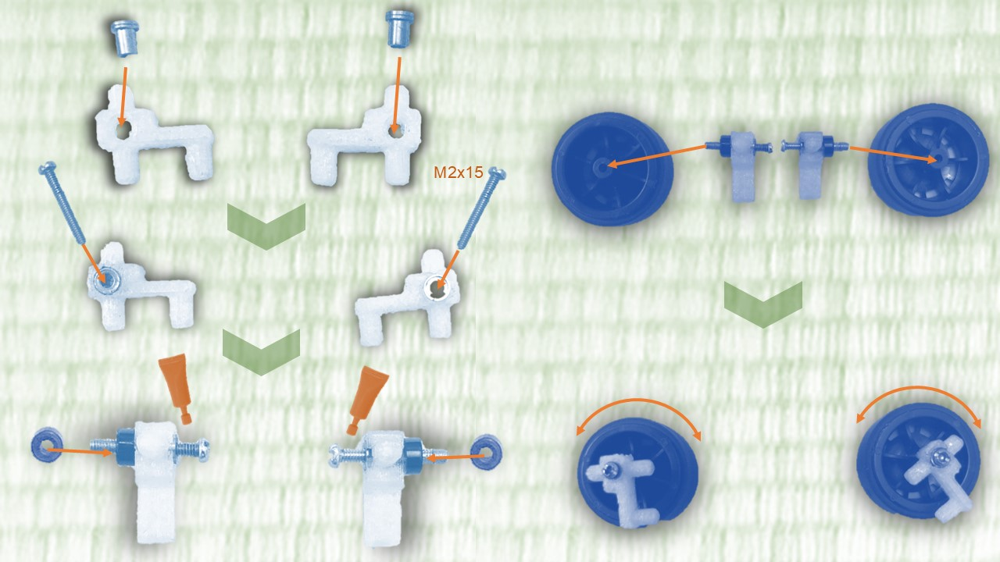
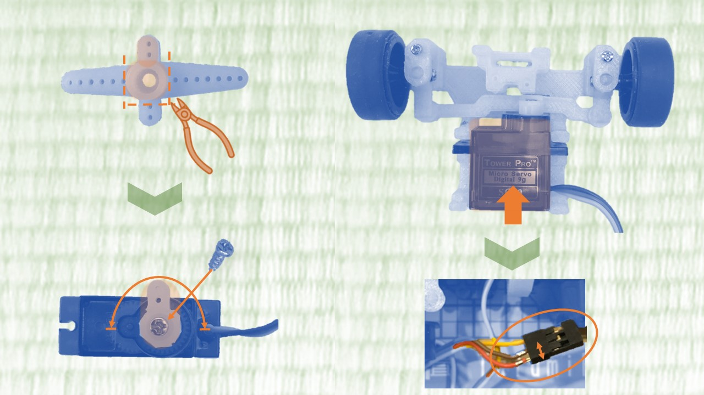
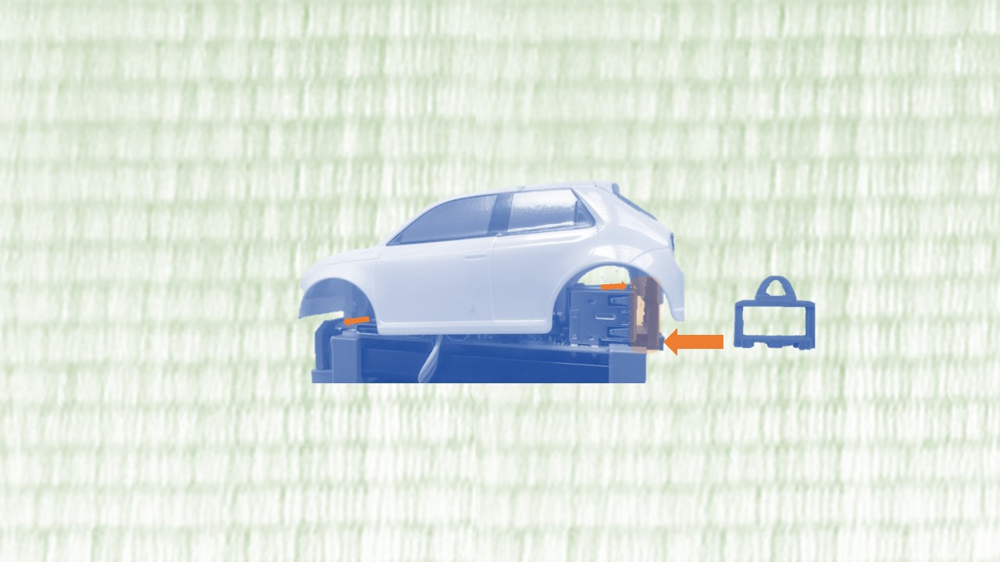

# TatamiRacer 組み立て説明 
### 全パーツ 

### Step 1 フロントホイール部品組み立て

### Step 2 フロントステアリングユニット組み立て
 

### Step 3 サーボモーター組み立て 
 

### Step 4 フロントステアリングユニット取り付け
 

### Step 5 マウントパーツの固定
 

### Step 6 後輪ユニットの組み立て
 

### Step7 カメラモジュール組み立て
 

### Step8 モータードライバーとハーネスの作成 
 

### Step 9 RaspberryPIボードとバッテリーの取り付け 
 

### Step 10 ボディの取り付け
 
