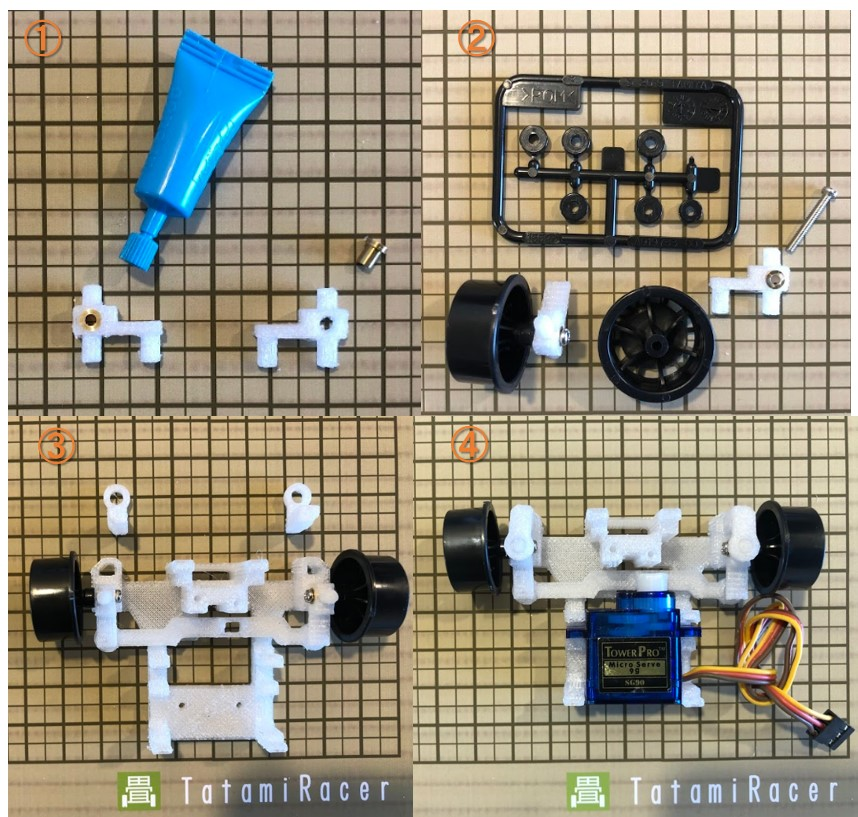

# How To Build TatamiRacer

# Prepare 3D Printed Parts  
Print parts kit by 3D printer. [STL file](../3d/tatamiracer_assembly.stl)  
Remove carefully support structure.  
  

# Build Parts
  

  

1. Build Front Steering Assy  
  
 
2. Build Rear Motor Assy

3. Attach Front Mount

4. Attache Rear Mount

5. Prepare Motor Driver

6. Attach Raspberry Pi Board and Battery.

7. Connect Cable
