# How To Build TatamiRacer

# Prepare 3D Printed Parts  
Print parts kit by 3D printer. [STL file](../3d/tatamiracer_assembly.stl)  
Remove carefully support structure.  
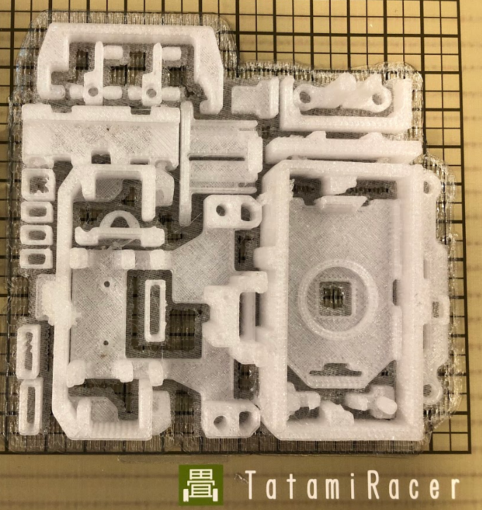  

# Build Parts
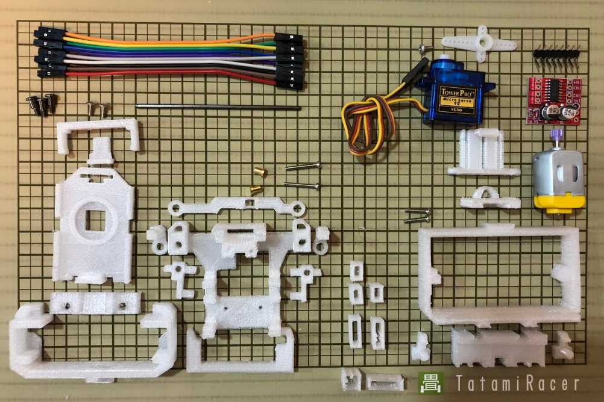  

  

1. Build Front Steering Assy  

- Insert a spacer into steering joint.  
- Connect wheel with M2x15 screw.  
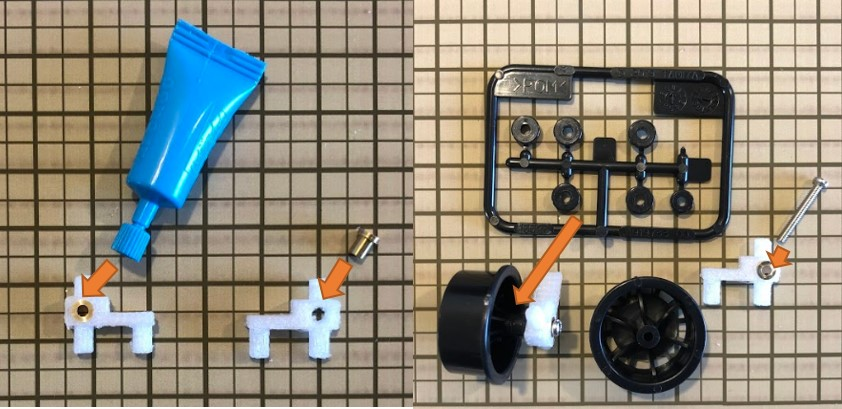  

- Build steering Assy.  
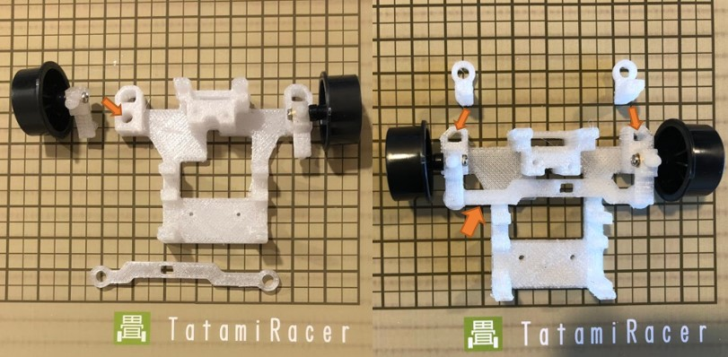  

- Cut the servo parts and connect it at center rotational position.  
- Attach the servo into the steering Assy.  
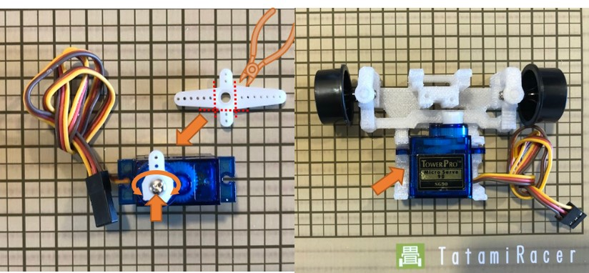  

- Attach the steering Assy into the chassis.  
- Tighten with M2x5 screws.  
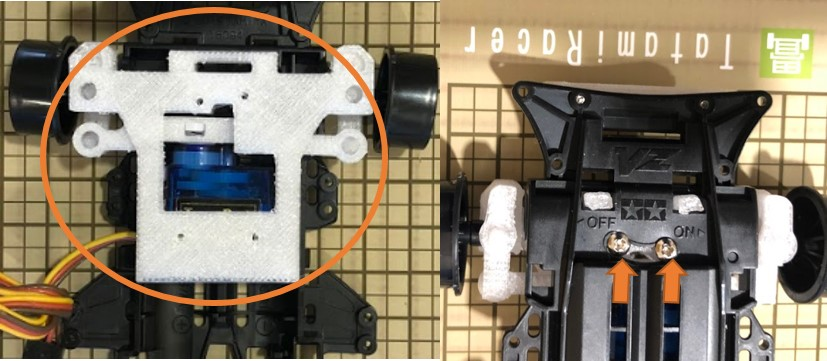  

- Insert the fixed parts to the chassis.  
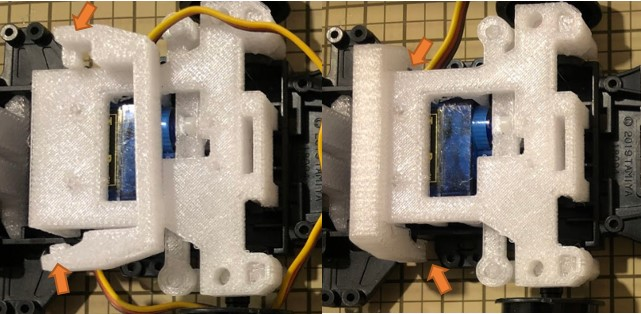  

2. Build Rear Motor Assy  

- Build the rear motor with 72mm shaft and spacer parts.(Use low speed type 130 motor instead of original motor.)  
- Insert the motor cover.  
  

- Insert jumper cable without housing to the contact parts.  
- Attace the contact parts.  
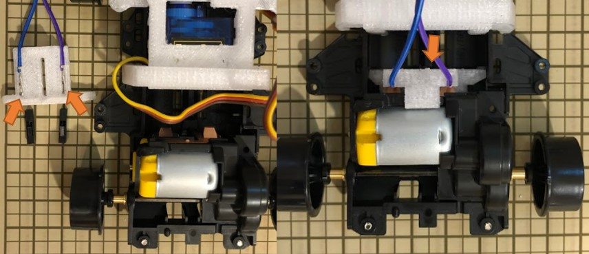  

3. Attach Front and Rear Mount

- Attach front mount and tighten with M2 step screws.
- Attach rear mount and tighten with M2x10 screws.
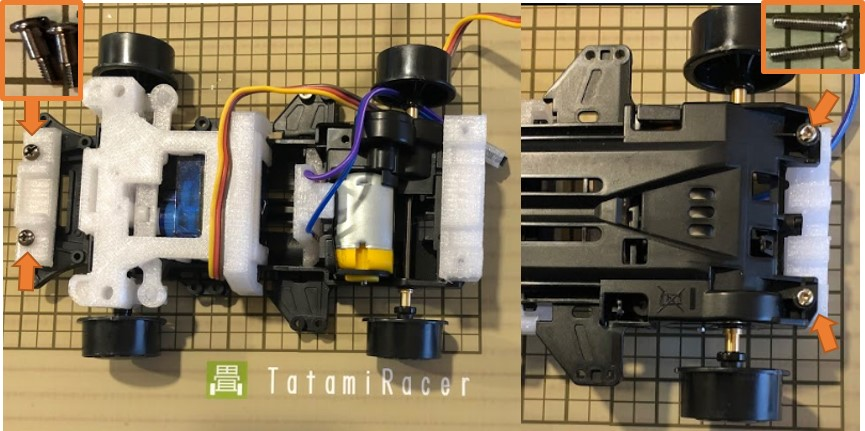  

- Insert front and rear mount parts.
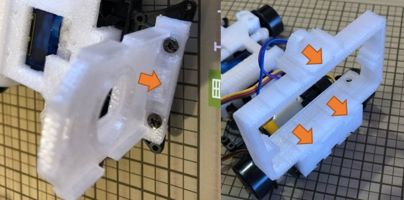  

4. Prepare Motor Driver  

- Prepare L-type pin header or bend pin headder. 
- Solder pin headder to motor driver board.  
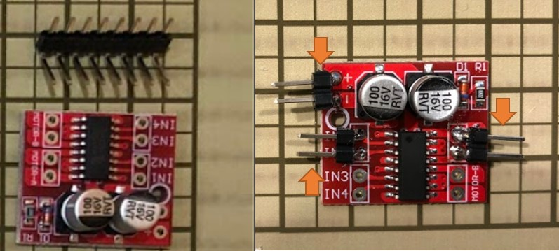  

5. Prepare wire harness  

- Swap VCC and GND pin of servo connector.
- Create wire harness with jumper cable and 3d printed wrapper parts.

  

6. Attach camera module and raspberry pi board. 
- Attach camera module to front mount.  
- Attach middle mount and tighten with M2 step screws.
- Insert Raspberry pi board and tighten with M2x5 screws.

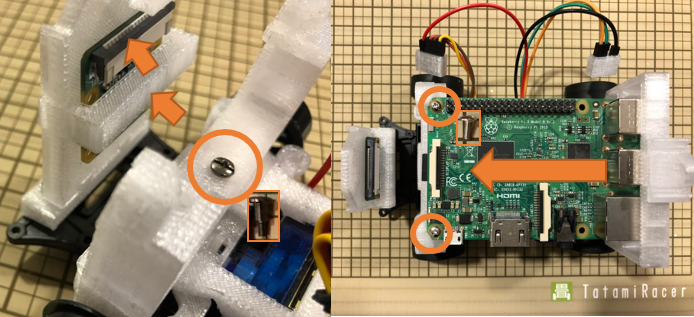  

7. Insert mobile battery

8. Connect jumper cable 

