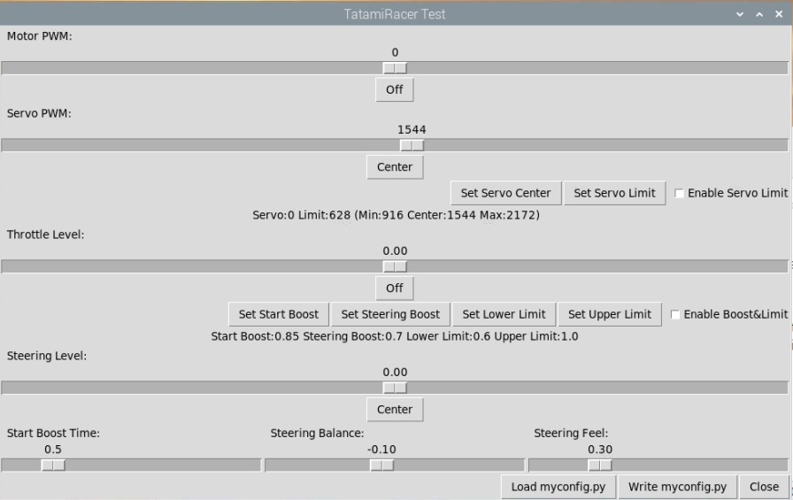
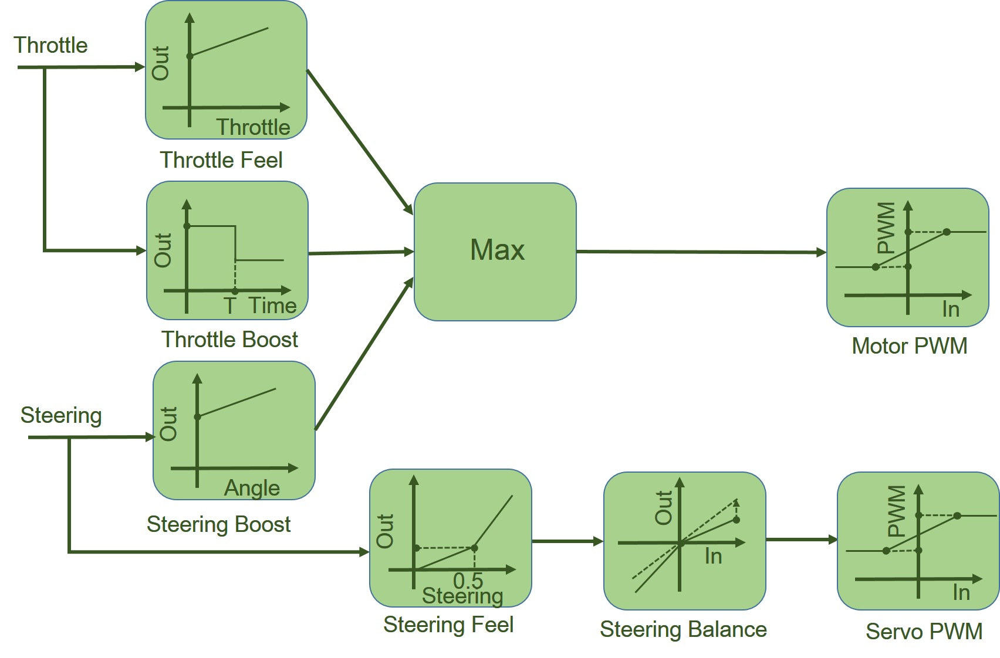

[Japanese(Google Translate)](https://github-com.translate.goog/covao/TatamiRacer/blob/master/doc/HowToCalibrateTatamiRacer.md?_x_tr_sl=en&_x_tr_tl=ja&_x_tr_hl=ja&_x_tr_pto=wapp) 

# How to Calibrate TatamiRacer

## Start TatamiRacaer Test Tool  
Launch "TatamiRacer Test" from shortcut or enter following command from terminal.
~~~
cd ~/mycar
python tatamiracer_test.py
~~~

## TatamiRacer Controller Overview
TatamiRacer controller enhance the motor start torque and feeling.  
This is a block diagram that controls throttle and steering.  

## Basic Calibration
### Calibrate Servo PWM
Purpose: Adjust the position of the steering center and steering limit
1. Turn off the <code>"Enable Servo Limit"</code> check button.
2. Adjust center position by <code>"Servo PWM"</code> slider.
3. Click <code>"Set Servo Center"</code> push button.
4. Check running straight by <code>"Motor PWM"</code> slider.
5. Move <code>"servo PWM"</code> slider until steering stop.
7. Click <code>"Set Servo Limit"</code> push button.
8. Turn on <code>"Enable Servo Limit"</code> check button..
9. Check the steering limit.

### Write the parameters to the "myconfig.py" file
1. Click the <code>"Write myconfig.py"</code> button.
2. Press <code>"Yes"</code> button in the dialog.

## Advanced Calibration
### Calibrate the Throttle Start Boost
Purpose: Smooth acceleration by increasing the starting torque
1. Turn off the <code>"Enable Boost&Limit"</code> check button.
2. Set the throttle slider to Off.
3. Raise the throttle slider until the the car starts running.
4. Click <code>"Set Start Boost"</code> at the throttle level.   
5. Set the throttle slider to Off.
6. Turn on the <code>"Enable Boost&Limit"</code> check button.
7. Raise the throttle slider a little.
8. Check that the car starts running.
9. Adjust <code>"Start Boost Time"</code> for smooth acceleration.

### Calibrate the Throttle Feeling
Purpose: Improved throttle sensitivity
1. Turn off the <code>"Enable Boost&Limit"</code> check button.
2. Set the throttle slider to Off.
3. Raise the throttle slider until the car moves.
4. Reduce the throttle slider at the minimum value that the car keeps running.
5. Click <code>"Set Lower Limit"</code> at the throttle level.
6. If you want to reduce the maximum speed, set the <code>"Upper Limit"</code> less than 1.0.
7. Turn on the <code>"Enable Boost&Limit"</code> check button.
8. Raise the throttle slider a little.
9. Check that the car keeps running.

### Calibrate the Throttle Steering Boost
Purpose: Improved torque when cornering
1. Turn off the <code>"Enable Boost&Limit"</code> check button.
2. Set the throttle slider to Off.
3. Set the Steerling slide max.
4. Raise the throttle slider until the car moves.
5. Reduce the throttle slider at the minimum value that the car keeps running.
6. Click <code>"Set Steering Boost"</code> at the throttle level.
7. Turn on the <code>"Enable Boost&Limit"</code> check button.
8. Set the Steerling slide at center.
9. Raise the throttle slider a little.
10. Set the Steerling slide max (right side).
11. Check that the car keeps running.
12. Set the Steerling slide min (left side).
13. Check that the car keeps running.

### Calibrate the Steering Feeling
Purpose: Improved control of small steering angles
1. Adjust <code>"Steering Feel"</code> slider.
2. Move Steering slider from left to right.
3. Check the steering feeling.

### Calibrate the Steering Balance
Purpose: Make left and right turns the same level
1. Set <code>"Steering level"</code> to about -0.8. (left side)
2. Run the car and check turn level.
3. Set <code>"Steering level"</code> to about +0.8.(right side)
4. Check the balance and adjust <code>"Steering Balance"</code> level

