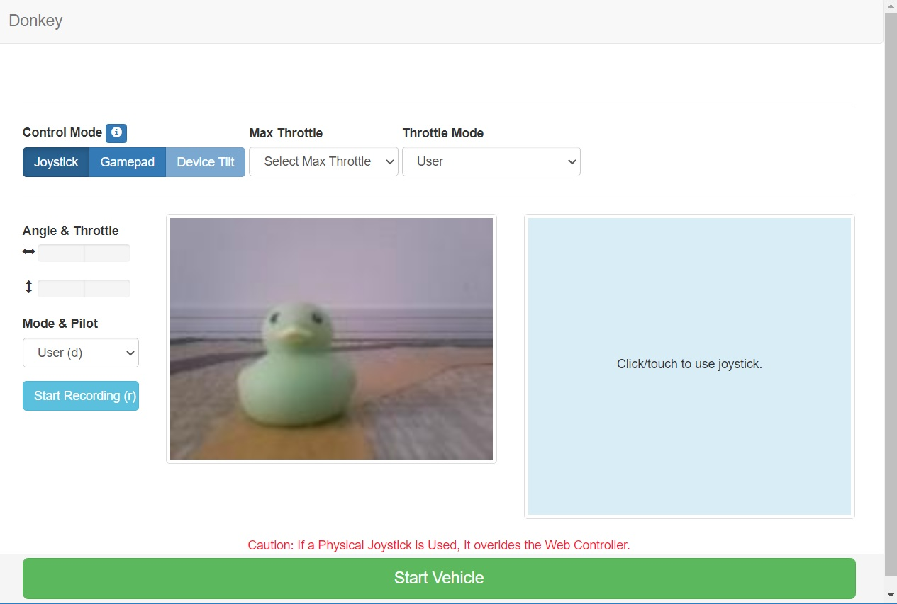

[Japanese(Google Translate)](https://github-com.translate.goog/covao/TatamiRacer/blob/master/doc/HowToGetDriving.md?_x_tr_sl=en&_x_tr_tl=ja&_x_tr_hl=ja&_x_tr_pto=wapp)
# How To Get Driving
TatamiRacer can be operated remotely with the web browser.  
This article is how to drive with a DonkeyCar web controller.  
See below for more information.
- [DonkeyCar > Drive your car](https://docs.donkeycar.com/guide/get_driving/)

## Start DonkeyCar Application
### Method 1: Desktop Shortcut 
1. Start "Donky Drive" or "Donky Drive with Model  

### Method 2: Command from terminal
1. Enter following command from terminal.
~~~
cd ~/mycar
python manage.py drive
~~~

## Web Controller
### Method 1: Donkey Copilot (Web controller suitable for smartphone)  

Please see https://github.com/covao/DonkeyCopilot

### [Demo Link](https://covao.github.io/DonkeyCopilot/copilot.html?demo)  

### Method 2: DonkeyCar web Controller  
2. Start the Web browser from the host PC or smart phone and enter following URL.
~~~
http://raspberrypi:8887/drive
~~~

3.  Select Control Mode  
- **Joystick mode**   It can be control by touch screen.
- **Gemepad mode**  It can be controlled by the gamepad connected to the host PC.

4. Drive your car. 

