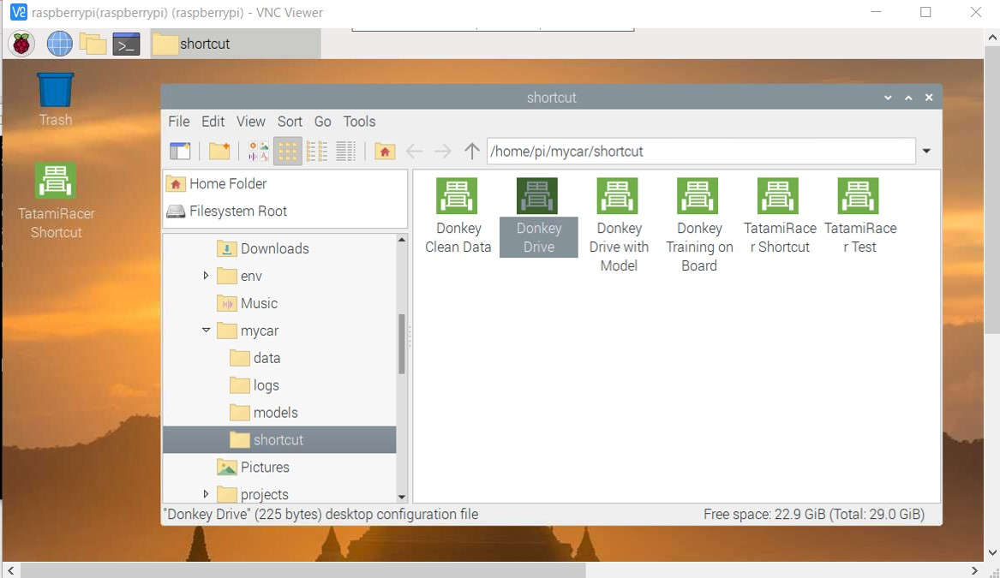

# How To Get Driving
TatamiRacer can be operated remotely with the web browser.  
This article is how to drive with a donkey car web controller.  
See below for more information.
- [Drive your car](https://docs.donkeycar.com/guide/get_driving/)

## Remote control with a web browser  
1. Start "Donky Drive" from the shortcut or enter following command from terminal.  

~~~
cd ~/mycar
python manage.py drive
~~~

2. Start the Web browser from the host PC or smart phone and enter following URL.
~~~
http://raspberrypi:8887/drive
~~~

3.  Select Control Mode  
- **Joystick mode**   It can be control by touch screen.
- **Gemepad mode**  It can be controlled by the gamepad connected to the host PC.

4. Drive the car. 
