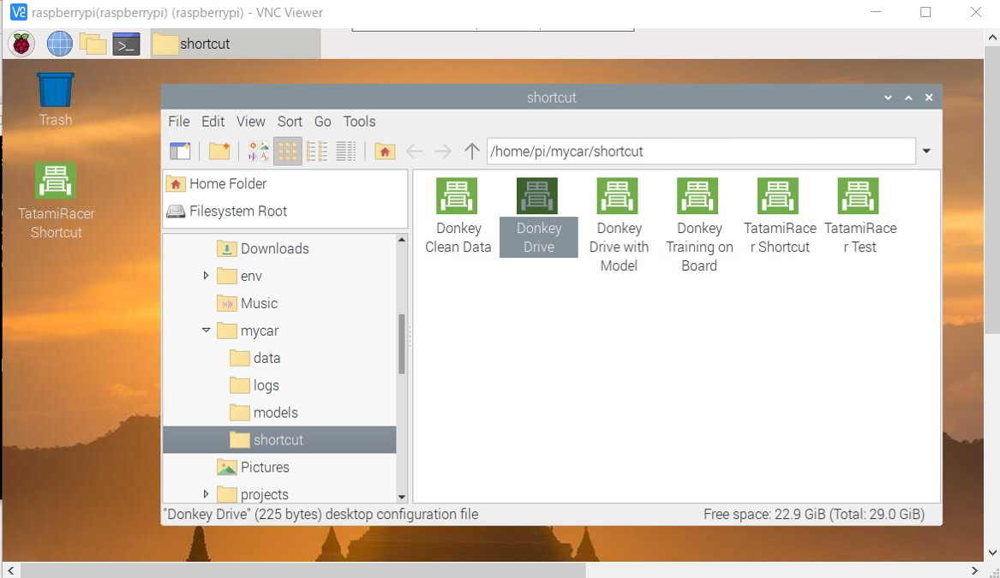

[Japanese(Google Translate)](https://github-com.translate.goog/covao/TatamiRacer/blob/master/doc/HowToSetupSoftware.md?_x_tr_sl=en&_x_tr_tl=ja&_x_tr_hl=ja&_x_tr_pto=wapp)  

# How To Setup Software

TatamiRacer can use DonkeyCar software.  
This page describes about installing DonkeyCar software and custumizing TatamiRacer.  

# Install Raspberry Pi OS using Raspberry Pi Imager
1. Download "Raspberry Pi Imager" from [Raspberry Pi official site](https://www.raspberrypi.org/software/). 
2. Install "Raspberry Pi Imager".
3. Start "Raspberry Pi imager".
4. Downlowd Raspbian-OS file from the following site.    
For TatamiRacer it is recommended to install the desktop version.  
Stable Raspbian version for DonkeyCar 
https://downloads.raspberrypi.org/raspios_armhf/images/raspios_armhf-2021-05-28/  
	2021-05-07-raspios-buster-armhf.zip     
 See note of Raspbian Bullseye issue of Donkey Car.
 [Flash Operating System](https://docs.donkeycar.com/guide/robot_sbc/setup_raspberry_pi/#step-1-flash-operating-system)

5. If you press advanced configration button, you can set WIFI, host name, SSH, user name and password, local setting.
6. Write Raspbian OS to your micro SD card.
7. Un plugging and re-inserting micro SD card.
8. Check the SD card drive. Boot files are appeared if OS image was flashed successfuly.

# Setup the WiFi for Raspberry Pi
Internet connection on Raspberry Pi is required before installation.
## - Method 1: WiFi setting in the Raspberry Pi Desktop (Monitor and keyboard for Raspberry pi are required.)
1. Insert micro SD card into Raspi.
2. Plug USB power supply of Raspi.
3. Login Raspberry Pi Desktop
4. Set Wifi configuration from Raspberry pi Desktop  
 See [Wireless connectivity in the Raspberry Pi Desktop](https://bwww.raspberrypi.org/documentation/configuration/wireless/desktop.md)
## - Method 2: WiFi setting by boot configuration file (Remote access is available without Raspi monitor and keyboard.) 
1. Create wpa_supplicant.conf in the top of SD card then edit ssid and password by texteditor  
 Please see ["Setting up a Raspberry Pi headless"](https://docs.donkeycar.com/guide/robot_sbc/setup_raspberry_pi/)
2. Create ssh file (empty file) in the top of SD card to enable SSH.  
 Please see ["SSH (Secure Shell)>3. Enable SSH on a headless Raspberry Pi"](https://www.raspberrypi.org/documentation/remote-access/ssh/)
3. Insert micro SD card into Raspi.
4. Plug USB power supply of Raspi and wait few minutes.
5. Launch command prompt and enter following command.  
 Check network connection between host pc and raspberry pi.  
~~~
 ping raspberrypi
 
~~~
OR
~~~
 ping raspberrypi.local
 
~~~

6. Launch ssh by following command.  
~~~
ssh-keygen -R raspberrypi
ssh pi@raspberrypi

~~~
If <code>"The authenticity of host 'raspberrypi... Are you sure you want to continue connecting (yes/no)?"</code> is appeared, enter yes.  

7. Enter password. Initial Password:<code>raspberry</code>

# Setup VNC
Remote desktop environment is useful to access Raspberry pi from host pc.  
1. You can install VNC with the following command.  
(You can enter the command from remote ssh or Raspberry pi desktop ternminal.)  
~~~
yes | sudo apt-get update
yes | sudo apt install realvnc-vnc-server realvnc-vnc-viewer
yes | sudo raspi-config nonint do_vnc 0

~~~
2. Set screen resolution
Select "Display Options-> Resolution" (At least 1280 x 720 recommended.)
~~~
sudo raspi-config

~~~
3. Select exit and reboot.  

4. Installation on the host PC is also requreired.  
See ["VNC (Virtual Network Computing)"](https://www.raspberrypi.org/documentation/remote-access/vnc/).  

# Launch Raspberry Pi Desktop
If you have VNC installed, you can use Remote Desktop.
1. Start Raspberry Pi Desktop.  
2. Launch Terminal window.

# Install Donkey Car Application for Raspberry Pi
## Method 1: Install by Shell Script 
1. First execute the following command.  
~~~
yes | sudo apt-get update
yes | sudo apt-get upgrade

~~~
*Press q when you see the following message.
<code>if webkit2gtk (2.31.1-1) experimental; urgency=medium ...</code>

2. The following command will install the latest Donkey Car application and create default "mycar" application.
~~~
wget "https://raw.githubusercontent.com/covao/TatamiRacer/master/raspi/install/install_donkey_raspi.sh" -O "install_donkey_raspi.sh"
sh -x install_donkey_raspi.sh

~~~
The shell script is here. [install_donkey_raspi.sh](https://raw.githubusercontent.com/covao/TatamiRacer/master/raspi/install/install_donkey_raspi.sh)

## Method 2: Install Manually Step by Step
See following procedure.
- [Get Your Raspberry Pi Working Step6 -Step12 ](https://docs.donkeycar.com/guide/robot_sbc/setup_raspberry_pi/#step-6-update-and-upgrade)
- [Create your car application](https://docs.donkeycar.com/guide/create_application/)

# Setup TatamiRacer by Shell Script 
The following command will replace 'manage.py' and 'config.py' and add 'tatamiracer_test.py' for TatamiRacer.  
In addition it will create the shortcut into desktop.  
~~~
wget "https://raw.githubusercontent.com/covao/TatamiRacer/master/raspi/install/setup_tatamiracer.sh" -O "setup_tatamiracer.sh"
sh -x setup_tatamiracer.sh

~~~
The shell script is here. [setup_tatamiracer.sh](https://raw.githubusercontent.com/covao/TatamiRacer/master/raspi/install/setup_tatamiracer.sh)

